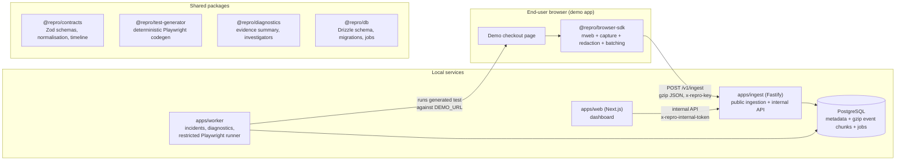

# Architecture

Repro is four processes and one database. Everything runs locally with Docker Compose for Postgres and `pnpm dev` for the rest.

## Request flow

1. **Record.** The SDK starts rrweb, patches `fetch`, `XMLHttpRequest`, `history`, `console.error` and `console.warn`, and listens for clicks, `change`, `submit`, `error` and `unhandledrejection`. Every event gets a sequence number and a timestamp. Redaction happens at capture time: masked input values are never in memory as plain text inside the SDK's event buffer.
2. **Upload.** Events are batched (every 2 s or 200 events), serialised, gzip-compressed with `CompressionStream`, and posted with `keepalive`. The last batch on `stop()` carries `final: true`. Failed uploads retry with bounded exponential backoff and a bounded queue.
3. **Ingest.** Fastify decompresses, enforces the size cap, validates with the shared Zod schema, re-sanitises URLs and scrubs messages as defence in depth, and writes one `event_chunks` row per batch inside a transaction. `(session_id, batch_seq)` is unique, so retries are idempotent. Session counters are updated in the same transaction. A final batch marks the session completed and enqueues `process_session`.
4. **Process.** The worker claims jobs with `FOR UPDATE SKIP LOCKED`, decodes chunks, extracts incidents (one per error fingerprint), and stores a deterministic evidence summary.
5. **Inspect.** The dashboard calls the internal API from the server side only. The rrweb player mounts inside its own sandboxed iframe. The timeline, evidence, test and runs panels are built from the same event list.
6. **Generate.** `@repro/test-generator` normalises events into actions and emits formatted Playwright TypeScript. Same input, same output, same hash.
7. **Reproduce.** The worker validates the generated file against an allowlist, writes it into a throwaway workspace, points the demo app at the requested mode, and runs Playwright with `execFile` (no shell) under a timeout. Result, logs, trace and screenshot are stored and shown in the dashboard.

## Why these boundaries

- **Contracts in one package.** The SDK, server, generator and dashboard all agree on event shapes through Zod schemas, so a malformed event is rejected at the edge and the rest of the system can trust its types.
- **Chunks are opaque and gzip.** `event_chunks.location` and `encoding` exist so the payload can move to object storage later. Only `apps/ingest/src/services/events.ts` and the worker's `events.ts` know how to decode a chunk.
- **Generation is synchronous, execution is asynchronous.** Generating a test is deterministic and takes milliseconds. Running one takes seconds and touches global state (the demo's mode), so it goes through the job queue and runs serially.
- **The dashboard never holds an ingestion key or the internal token in the browser.** Server components and route handlers proxy every call.
- **AI is a plug-in, not a dependency.** `createInvestigatorFromEnv` returns the rule-based investigator unless a gateway key and model are configured. Tests never touch the network.

## Repository layout

| Path | Responsibility |
| --- | --- |
| `apps/web` | Next.js dashboard |
| `apps/ingest` | Fastify ingestion and internal API |
| `apps/worker` | job processing and the reproduction runner |
| `apps/demo` | intentionally broken checkout used by the E2E suite |
| `packages/browser-sdk` | recording SDK (ESM and IIFE builds) |
| `packages/contracts` | shared schemas, normalisation, timeline model |
| `packages/db` | Drizzle schema, migrations, seed, job queue |
| `packages/test-generator` | deterministic Playwright generation |
| `packages/diagnostics` | evidence summaries and investigators |
| `packages/config` | shared tsconfig and ESLint |
| `tests/e2e` | the complete product journey |
| `scripts/bench` | reproducible benchmarks |
| `docs` | this folder |

## Data model

See `packages/db/src/schema.ts`. Every table that holds session data carries `project_id` and is indexed for the dashboard's queries: sessions by `(project_id, started_at desc)`, `(project_id, status)`, `(project_id, release)`, `(project_id, initial_route)`, `(project_id, browser_name)` and `(project_id, error_count)`; incidents by `(project_id, created_at desc)` and `(session_id, fingerprint)`; chunks by `(session_id, batch_seq)`.

### Retention and deletion

- Each project has `retention_days` (default 30). `pnpm --filter @repro/db retention` deletes sessions whose `started_at` is older than that. Deleting a session cascades to chunks, incidents, generated tests, runs and findings.
- `DELETE /api/projects/:projectId/sessions/:sessionId` deletes one session immediately.
- Run artifacts on disk (`apps/worker/artifacts/<runId>`) are not removed by the database cascade in this release. See `docs/LIMITATIONS.md`.
